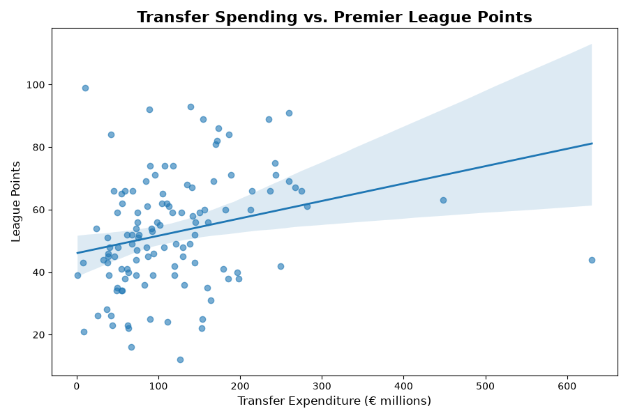
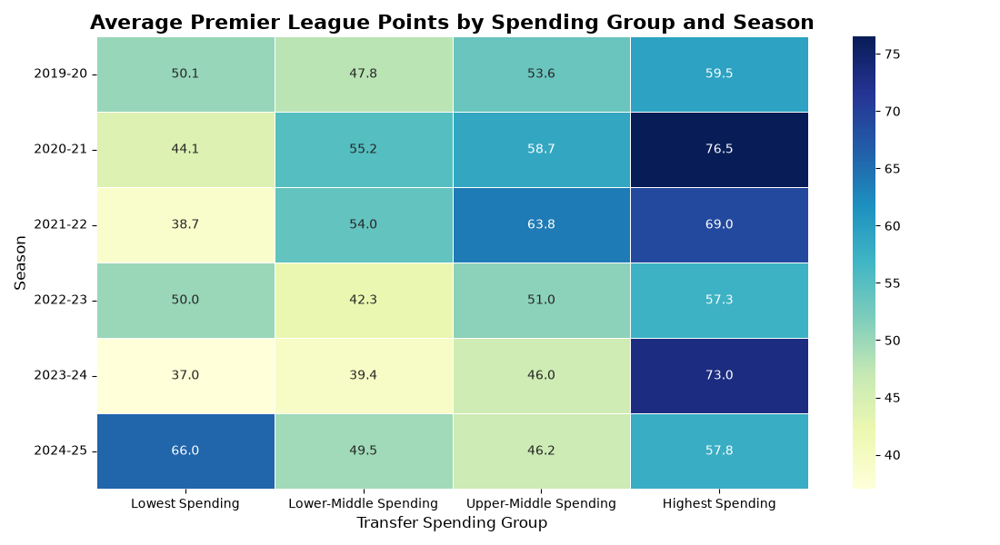

# ⚽ Transfer Spending & Premier League Success

## Research Question

**To what extent is transfer spending associated with the success of English Premier League clubs?**

The goal of this project is to look at whether clubs that spend more money on transfers tend to have more success in the Premier League. This is an interesting question because transfer spending is a major part of how clubs build their teams, but spending a lot of money does not always lead to better results.

---

## Why This Question Matters

Professional soccer clubs spend millions of dollars on players every season, so it is useful to understand whether that spending is actually connected to success on the field. This question could be useful to club executives, analysts, coaches, and fans who want to better understand how spending relates to performance.

Previous research has also found a connection between player investment and football performance, although the strength of the relationship can vary between clubs and seasons (Nowland & Sankara, 2024; Matesanz et al., 2018).

---

## Data Sources

This project combines data from two sources:

* **Football-Data.co.uk** — Premier League match results from the 2019–20 through 2024–25 seasons.
* **Transfermarkt** — Premier League transfer expenditure for the same six seasons.

The Football-Data.co.uk dataset contains individual Premier League matches, while the Transfermarkt data contains transfer spending by club and season.

[Football-Data.co.uk Premier League Data](https://www.football-data.co.uk/englandm/premier-league)

[Transfermarkt Premier League Transfer Data](https://www.transfermarkt.com/premier-league/einnahmenausgaben/wettbewerb/GB1)

---

## Data Description

The original match dataset has **2,280 observations**, with each row representing one Premier League match. There are 380 matches in each of the six seasons included in the project.

The match data includes information such as:

* Date
* Home team
* Away team
* Home goals
* Away goals
* Match result

I used these match results to calculate team-level statistics for each season.

The transfer data contains **120 club-season observations**, representing 20 Premier League clubs in each of the six seasons. Each observation represents one club's transfer expenditure during a season.

After combining the two datasets, the final analysis dataset contains **120 club-season observations**.

There were **no missing values** in the variables used for the final analysis.

---

## Variables

### Transfer Expenditure

**Conceptual variable:**
How much money a Premier League club spends acquiring players through transfers.

**Operational variable:**
The club's total transfer expenditure for a season, measured in millions of euros using Transfermarkt's reported transfer data.

### League Points

**Conceptual variable:**
A club's success in the Premier League.

**Operational variable:**
The total number of league points earned during the season. A win is worth 3 points and a draw is worth 1 point.

### Final Position

**Conceptual variable:**
Where a club finished in the Premier League standings.

**Operational variable:**
The club's final position in the league table, with 1 representing first place.

### Goal Difference

Goal difference was calculated by subtracting goals conceded from goals scored. This was used as additional information when determining final league position.

---

## Data Cleaning & Preparation

The original match dataset contained one row for each match, so I grouped the results by club to create one observation per team for each season. I calculated league points using the standard scoring system of three points for a win and one point for a draw. I also calculated total goals scored, goals conceded, and goal difference.

The transfer data required some cleaning because club names were not always written the same way in the two datasets. For example, one source used "Manchester City" while the other used "Man City." I standardized these names before merging the datasets.

After cleaning the club names, I combined the match and transfer data using the club and season. This resulted in 120 club-season observations with no missing values.

---

## Visualization 1: Transfer Spending and League Points

This scatterplot compares transfer expenditure with league points for all 120 club-season observations from 2019–20 through 2024–25.

The trend line shows a slight positive relationship between spending and points. However, the observations are spread out around the line, which suggests that transfer spending alone does not strongly explain league success.

**Correlation: 0.265**

---

## Visualization 2: Average Points by Spending Group

To look at the relationship another way, I divided the club-season observations into four spending groups based on transfer expenditure.

The heatmap shows the average number of league points earned by each spending group during each season. The results change from season to season, showing that higher spending does not always result in higher average points.

---

## Statistical Results

The correlation between transfer expenditure and league points was **0.265**. This represents a weak positive relationship.

I also calculated the squared correlation, which gives an **R² of about 0.07**. In simple terms, transfer spending explains about **7% of the variation in league points** in this analysis.

This means that teams that spend more money generally tend to earn more points, but the relationship is not very strong. Most of the differences in team performance are explained by other factors that are not included in this analysis.

---

## What I Found

The results show that there is a small positive relationship between transfer spending and league success. Teams that spent more money on transfers generally earned more points, but spending alone did not strongly explain how successful a team was.

The scatterplot shows this because the teams are spread out instead of being close to the trend line. The heatmap also shows that the relationship can change from season to season.

This suggests that spending money is not the only thing that matters when building a successful team. Coaching, player development, injuries, and the quality of players already on the team could also have an impact.

Overall, the results suggest that spending more on transfers can be related to better results, but it does not guarantee success. Because this analysis looks at an association rather than causation, we cannot say that spending more money directly causes a team to perform better.

---

## Limitations, Ethics, and Reflection

There are a few limitations to consider when looking at these results. First, transfer spending is only one part of how a club builds its team. This dataset does not include things like player wages, coaching, injuries, or the quality of a club's existing players. These factors could also have a major effect on how successful a team is.

Another limitation is that the transfer spending data includes transfers made during the season. Because of this, the spending may not always happen before the team earns its points, which makes it harder to use spending as a true predictor of success.

The data also covers only six seasons, so different teams and different circumstances can affect the results from one season to another.

There are also limitations with the data sources. Transfermarkt is a secondary source, meaning the transfer information was collected and reported by another organization rather than directly from the clubs. Transfer fees may also be reported differently depending on the source. I also checked Transfermarkt's robots.txt before scraping, which currently allows general user agents to access the site. I limited the scraping to the six seasons needed for this project rather than making excessive requests.

Finally, the results only show a relationship between spending and success. They do not prove that spending more money causes a team to perform better. A club could spend a lot and still perform poorly, while another club could spend less and have a successful season.

---

## Academic Research

Previous research provides some context for these findings. Nowland and Sankara (2024) found that investment in players was associated with improved football performance over time, while also accounting for the possibility that clubs may change their spending based on previous performance. Matesanz et al. (2018) also found that transfer market activity can be important for sporting performance, although the relationship varies between leagues and clubs. Abdul et al. (2025) examined spending and performance in the Premier League and found that the clubs with the highest levels of spending tended to include many of the league's top teams.

These studies support the idea that transfer spending can be related to performance, while also showing why spending should not be treated as the only explanation for success.

---

## References

Abdul, A., Chattopadhyay, A. K., & Jain, S. (2025). The impact of foreign players in the English Premier League: A mathematical analysis. *OPSEARCH, 63*, 1812–1843. https://doi.org/10.1007/s12597-025-00963-5

Matesanz, D., Holzmayer, F., & Torgler, B. (2018). Transfer market activities and sportive performance in European first football leagues: A dynamic network approach. *PLOS ONE, 13*(12), e0209362. https://doi.org/10.1371/journal.pone.0209362

Nowland, J., & Sankara, J. (2024). New players? New managers? New stadiums? Which investments drive football club performance? *Sport, Business and Management: An International Journal, 14*(4), 540–556. https://doi.org/10.1108/SBM-10-2023-0124

--- 

## Code

The full Python notebook used for this analysis is available here:

[View the Project 1 Notebook](https://github.com/MaZuMercury/Studio-two-portfolio/blob/main/Project1.ipynb)

---

## AI Transparency

I used ChatGPT (GPT-5.6 Luna) to help brainstorm the research question, troubleshoot Python code, organize parts of the analysis, and improve the clarity of my written explanations. I reviewed and tested the code and checked the final results myself.
